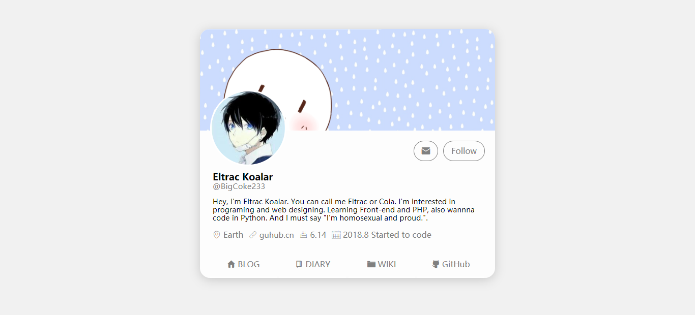
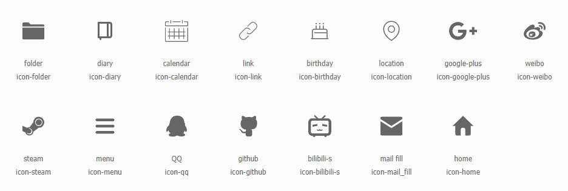

# Profile Card
> A cool well-designed web profile card.

The style has referenced the profile of Twitter.

It's totally static. So just replace the text if you wanna use it on your website. And if you like, please `star` this repository. It's still incomplete and you could report the errors or something that can be improved in the issues.



And these're all the icons which can be used.



```html
<!-- usage -->
<i class="iconfont icon-name"></i>
```

## Support

如果可以的话，你可以在[爱发电](https://afdian.net/@Eltrac)上赞助我。

---

Copyright &copy; 2020 Eltrac, released under MIT License. 
